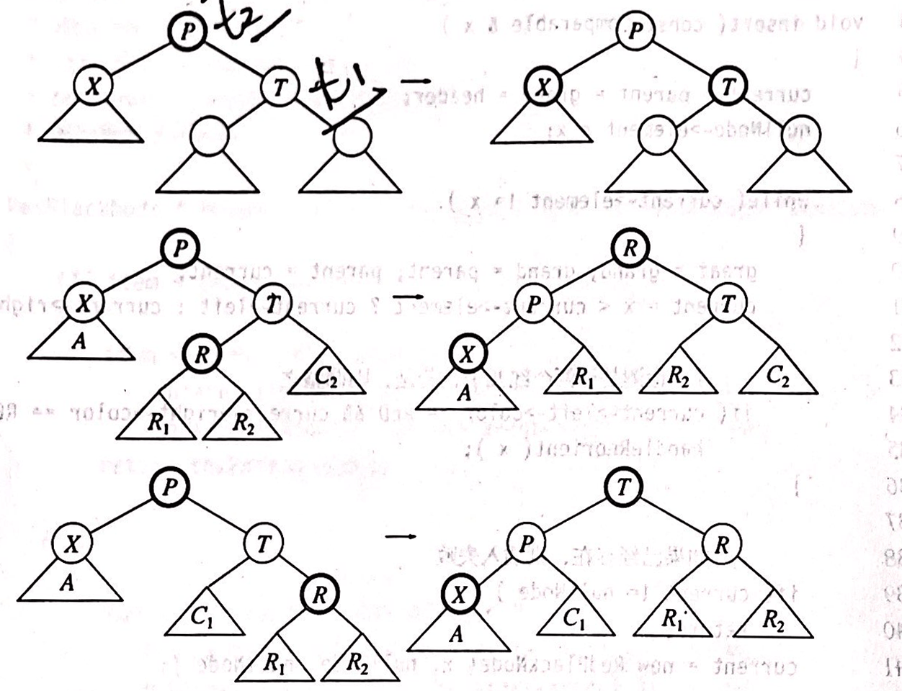

---
documentclass:
    - ctexart
---

# Lab3 实验报告

## AVL树

### AVL树的定义与分析

AVL(Adelson-Velskii & Landis)树是具有平衡条件的二叉搜索树。我们知道，二叉搜索树的插入、查询、删除的时间复杂度均为$O(h)$，因此理论上，完全二叉树是最快的。但是，我们发现维护完全平衡二叉树的性质过于困难，因此出现了各种平衡条件稍微放松一些的二叉搜索树。而AVL树的平衡条件是：左右子树的高度最多相差1。（空树的高度为-1）。下面我们来证明，AVL树的高度最多约为$1.44 log(N+2) - 0.328$，这也告诉我们AVL树的各项操作的时间复杂度均为$O(log N)$：

我们令$S(h)$为高度为$h$的AVL树的最少节点数。显然我们有：

$$
\begin{aligned}
S(0)=1 \\
S(1)=2
\end{aligned}
$$

树的最少节点数等于左右子树的最少节点数之和加1（自身）。而根据AVL树的性质，左右子树高度最多相差1，因此我们有：

$$
S(h)=S(h-1)+S(h-2)+1
$$

而这个式子与斐波那契数列的递推式很相似，事实上，我们有：

$$
(S(h)+1)=(S(h-1)+1)+(S(h-2)+1)
$$

令$F(n)$为斐波那契数列：

$$
\begin{aligned}
F(0)&=0\\
F(1)&=1\\
F(n)&=F(n-1)+F(n-2)
\end{aligned}
$$

因此，我们可以得到：

$$
S(h)=F(h+2)-1
$$

斐波那契数列可以通过取整函数进行运算和反运算：

$$
\begin{aligned}
F(n)&=\lfloor \frac{\varphi^n}{\sqrt{5}+\frac{1}{2}} \rfloor \\
n(F)&=\lfloor log_\varphi (\sqrt{5}F+\frac{1}{2}) \rfloor \\
\varphi&=\frac{1+\sqrt{5}}{2}
\end{aligned}
$$

代入$S(h)$：

$$
\begin{aligned}
h_{max}&=n(S+1)-2 \\
&=\lfloor log_\varphi (\sqrt{5}(S+1)+\frac{1}{2}) - 2 \rfloor \\
&< log_\varphi(2) log_2(S+2)+log_\varphi\sqrt{5}-2 \\
&\approx 1.44 log_2(S+2)-0.328
\end{aligned}
$$

因此，节点数为N的AVL数的最大高度约为：

$$
1.44 log_2(N+2)-0.328
$$

可以看到，AVL数的高度和理想高度$log(N)$相差无几，是平衡得比较优秀的二叉搜索树。

### 插入与删除

插入操作和普通二叉树非常类似，只是在插入完成之后加入了一行维护平衡的代码：

```cpp
void AvlTree::insert( Node*& n, int element )
{
	if ( n == nullptr )
	{
		n = new Node();
		n->data = element;
		return;
	}
	else if ( n->data > element )
	{
		insert( n->left, element );
	}
	else if ( n->data < element )
	{
		insert( n->right, element );
	}

	balance( n );
}
```

一个小技巧就是传入参数为节点指针的引用，这样可以直接对这个引用新建节点，而且可以保证和其父节点“自动”链接，而省去更多的判断。

删除一个叶子节点或只含有一个子树的节点非常简单：直接用空指针或那个子树替代即可。而要删除含有两个子树的节点，我们就可以使用右子树的最小节点来替代这个节点，然后转而删除那个节点。显然，替换后需要删除的节点最多含有一个子树。当然不要忘记重新维护平衡。

```cpp
void AvlTree::remove( Node*& n, int element )
{
	if ( n == nullptr )
	{
		return;
	}

	if ( n->data > element )
	{
		remove( n->left, element );
	}
	else if ( n->data < element )
	{
		remove( n->right, element );
	}
	else if ( n->left != nullptr && n->right != nullptr )
	{
		n->data = findMin( n->right )->data;
		remove( n->right, n->data );
	}
	else
	{
		auto m = n;
		n = ( n->left == nullptr ) ? n->right : n->left;
		delete m;
	}

	balance( n );
}
```

### 平衡维护与旋转

插入和删除操作均有可能破坏AVL树的平衡性质，为了维护性质，我们使用单旋转或双旋转操作。

若子树的“外侧”不平衡（即左子树的左子树或右子树的右子树高度不平衡），我们通过单旋转来维护：

| 右旋转         | 左旋转         |
| -------------- | -------------- |
|  |  |

```cpp
void AvlTree::rightRotate( Node*& n )
{
	auto m = n->left;
	n->left = m->right;
	m->right = n;
	updateHeight( n );
	updateHeight( m );
	n = m;
}

void AvlTree::leftRotate( Node*& n )
{
    // Obmitted
}
```

当然，旋转之后也要可能发生变化的子树的高度：

```cpp
int AvlTree::getHeight( Node* n ) { return n == nullptr ? -1 : n->height; }
```

若子树的“内侧”不平衡，我们可以对子树的一次单旋转来让不平衡转移到“外侧”，再通过上面的单旋转完成平衡操作。

| 左右双旋转     | 右左双旋转     |
| -------------- | -------------- |
|  |  |

```cpp
void AvlTree::rightLeftRotate( Node*& n )
{
	rightRotate( n->right );
	leftRotate( n );
}

void AvlTree::leftRightRotate( Node*& n )
{
	leftRotate( n->left );
	rightRotate( n );
}
```

这样我们的`balance`函数只需要判断四种不平衡情况即可调用对应的函数完成平衡，具体代码较为冗长在此省略。

这里的代码也是用了上面说的小技巧，来保证旋转后的子树的根自动与父节点链接。

可以看到，各旋转以及平衡操作均可在常数时间内完成，而每次`insert`与`remove`函数均只进行一次平衡（不考虑递归），因此不改变他们的时间复杂度估计，依旧是$O(log(N))$。

## 红黑树

### 红黑树的定义与分析

红黑树是另一种著名的平衡二叉搜索树实现。虽然它对平衡性的要求相对于AVL树来说有所减弱，但是其性质的特殊性和代码实现上的谨慎思考让其的平均旋转操作次数更少（相对于AVL树），因此也被广泛使用。

红黑树是满足以下性质的二叉搜索树：

1. 每个节点具有颜色，而且要么是红色，要么是黑色
2. 根节点是黑色的
3. 红色节点的子节点必为黑色
4. 从一个节点到一个空子树（空指针）的每一条路径均包含相同数量的黑色节点

经过简单的思考，我们可以知道，从根出发到叶子节点，最长的路径（红黑相间）的长度是最短路径（全黑）的两倍。进而得出，节点个数为N的红黑树的高度最多为$2 log(N+1)$，因此红黑树的各项操作的时间复杂度也为$O(log(N))$。

### 一些实现细节

- 我在本次试验中，使用了自顶向下的红黑树实现。与常规方法不同的是，这种实现的插入和删除不需要递归，因此运行效率、旋转次数和空间效率都更为优化，插入与删除的实现复杂度也有所平均。
- 红黑树的实现非常复杂，因为要考虑各种可能的旋转情况和空指针、根节点等边界情况。因此我们使用两个哨兵节点，一个代表空节点，作用如同`nullptr`但是可以避免询问子树和颜色等情况的特殊讨论；另一个节点为`header`，其右子树为真正树的根，这样可以避免在根需要被旋转时考虑的特殊情况。
- 红黑树在空间上，可以通过压缩颜色信息来优化内存占用。本Lab中限制了元素的范围，因此我们可以利用`data`的第一位储存颜色信息。当然我们也可以在保证内存分配对齐的情况下，利用左右指针的空位来进行储存。最后我抽离了颜色与数据的访问与修改函数，以便更改数据储存方式。

### 自底向上的插入

我们可以在一般二叉平衡树的插入操作完成后再维护红黑树性质。首先，插入的新节点一定为红色，否则直接违反性质4。这样的话，我们检查父节点是否也为红色。如果不是，插入完成。如果是，需要进行旋转来保持性质。


如上图，我们先假设新添加节点X的父节点P的兄弟S为黑色（边框细的为黑色节点，边框粗的为红色节点）。无论X是在子树的内侧还是外侧，都可以通过与AVL树相同的旋转操作完成性质的维护。这样旋转后，将新子树的根节点标记为黑色，这样不会与其父节点的颜色产生冲突。然后令其两个子节点为红色来维持性质4。

然而，如果S为红色，那么上面的方法将会产生相邻的红色节点，违反性质3。对于子树C来说，从整个子树的根G到其的路径上只有一个黑色节点，但旋转之后这个路径上一定存在新子树的根、G和S三个节点，这样新子树的根和S都必须标记为红色。但是如果新子树的父节点也为红色，那么我们还应该向上继续进行同样的维护过程，直到不存在两个相邻的红色节点或根为止，这个过程称为上滤(percolate)。这个过程需要递归或栈结构来保存子树链，实现较为复杂。

### 自顶向下的插入

从上面的讨论我们可以知道，如果S节点为黑色，那么插入过程会非常简单。而且幸运的是，我们可以通过自顶向下的插入保证S节点一直为黑色。

这个方法依赖于颜色反转的操作。在自顶向下的寻找插入位置的过程中，如果我们发现当前节点X的两个子节点均为红色，那么直接对X和其两个子节点进行颜色反转，即X标为红色，两个子节点标为黑色。但如果P也为红色，我们可以应用上一节讨论的方法进行维护。而且由于我们保证在到达这个节点的过程中，S节点一直为黑色，因此维护操作非常简单。注意：颜色反转会将一个子树的根标为红色，而且这个节点也有可能是整个红黑树的根，我们需要在维护完成时直接将其标为黑色来维持性质。

在这个操作之后，我们可以保证接下来的S节点也为红色。因为若X的两个子节点都为红色，那么其所有的孙子节点均为黑色。并且在操作后，X的子节点也均为黑色。那么，X以下两层的节点将不会有红色出现。这样我们保证了这个操作后不会出现新的子节点均为红色的节点。

又因为，若我们发现X的父节点为红色，则其兄弟节点必为黑色，否则会在前面被处理掉。而且本实现中，根的“假”兄弟节点（空节点）和“假”父节点均为黑色，因此初始条件可以保证。

综上，我们可以保证在这个过程中，S节点一直为黑色。

### 插入实现

在实现上，我们定义了助手函数`rotateUp(ele, parent)`，它可以将`ele`元素所在的子树向上旋转到`parent`的对应链接上，并返回新的子树的根。这样我们就封装了繁琐的比较和判断操作。这个函数和各种旋转的具体实现省略。

`handleReorient`实现了颜色反转操作，是插入操作的核心：

```cpp
void RedBlackTree::handleReorient( int ele )
{
    // 颜色反转
	setRed( { current } );
	setBlack( { current->left, current->right } );

	if ( isRed( p1 ) )
	{
		setRed( { p2 } );
		if ( ele < getData( p2 ) != ele < getData( p1 ) )
		{
            // 利用比较后结果是否相等来判断是否需要双旋转
			p1 = rotateUp( ele, p2 );
		}
		current = rotateUp( ele, p3 );
		setBlack( { current } );
        // 经过分析，只有祖父节点(p2)和当前节点(current)需要维护颜色
	}

    // 维护根节点颜色
	setBlack( { header->right } );
}
```

插入操作总入口函数为`insert`。实现上有一些需要注意的点：

1. `current`,`p1`,`p2`,`p3`均需要在`handleReorient`中使用，因此定义在类中，避免复杂的参数传递。
2. 又一次利用了`nullNode`哨兵。将其数据设置为要插入的数据，这样我们保证可以找到数据符合的节点。若这个节点为`nullNode`，则可以插入，否则说明以前存在。这样可以避免更多边界情况的处理。
3. 最后需要再次进行`handleReorient`，来保证新插入节点为红色，`nullNode`为黑色。

```cpp
void RedBlackTree::insert( int x )
{
	current = p1 = p2 = header;
	setData( nullNode, x );

	while ( getData( current ) != x || current == header )
	{
		p3 = p2;
		p2 = p1;
		p1 = current;
		current = x < getData( current ) ? current->left : current->right;
		if ( isRed( current->left ) && isRed( current->right ) )
		{
            // 处理颜色反转
			handleReorient( x );
		}
	}

	if ( current != nullNode )
	{
		return;
	}
	current = new Node;
	setData( current, x );
	current->left = current->right = nullNode;

	if ( x < getData( p1 ) )
	{
		p1->left = current;
	}
	else
	{
		p1->right = current;
	}
	handleReorient( x );
}
```

### 自顶向下的删除

同样，删除操作也可以自顶向下进行。

首先，删除任意一个节点，都可以归结为删除一个树叶节点。如果要删除节点有一个右子树，那么可以用右子树的最小节点将其替换，然后删除那个节点。如果要删除节点有两个子树，用同样的方法也可以替换和删除。如果要删除的节点有一个左子树，那么我们可以用左子树的最大节点替代和删除。我们避免直接将只有一个子树的节点通过链接子树的方式删除，因为这可能会链接两个红色节点，让性质维护变得困难。

对于一个要被删除的叶子节点，如果其颜色为红色，那么直接删除即可。但如果颜色为黑色，直接删除会导致性质4的异常，维护更加困难。因此，我们会在自顶向下的操作中保证当前节点为红色。

以下的讨论中，X为当前节点，P为X的父节点，T为X的兄弟节点。我们在向下寻找删除节点的过程中，要确保X为红色的。当前进的下一层节点之后，P将为黑色的，X与T将为红色的。因此我们分情况讨论，试图让新的X为红色：

1. 当X有两个黑儿子时：
   1. 若T也有两个黑儿子，那么我们令X、T、P颜色反转即可；
    ```cpp
    setRed( { c, t } );
    setBlack( { p, nullNode } );
    ```
   2. 若T有一个红儿子，那么我们可以通过适当的单旋转或双旋转和重新着色，让新子树的根和X为红色，剩余剩余两个节点的颜色为黑色来保持红黑树性质。T的两个子节点均为红色也适用这种情况，任意旋转均可；
    ```cpp
    if ( getData( c ) < getData( p ) )
	{
		if ( !isRed( t->right ) )
		{
			rightRotate( p->right );
		}
	}
	else
	{
		if ( !isRed( t->left ) )
		{
			leftRotate( p->left );
		}
	}
	Node* subroot = rotateDown( x, g );
	setRed( { subroot, c } );
	setBlack( { subroot->left, subroot->right } );
    ```
2. 当X至少有一个子节点为红色时：
   1. 若X的下一步将会落到红色子节点上，那么可以直接前进到下一层。注意仍然要判断该节点是否为要删除的节点。向下一层推进的代码会在后面给出；
   2. 否则，对其进行简单的旋转，将X旋转下去，令T为新子树的根，并让X为红色、P黑色。其中要注意对父节点P的维护。
    ```cpp
	p = rotateDown( x, p );
	setBlack( { p } );
	setRed( { c } );
    ```



上图描述了情况1.2的旋转操作。


上图描述了情况2.2的旋转操作。

经过上述所有情况的讨论，我们发现，X节点总会变为红色。这样就可以保持性质一直向下推进，直到达到某个叶子节点。这时我们就可以判断是否找到需要删除的节点，若找到，进行替换和删除：

```cpp
if ( toDelete != nullptr )
{
	setData( toDelete, getData( c ) );
	Node*& uplink = getData( c ) < getData( p ) ? p->left : p->right;
	if ( getData( c ) < getData( p ) )
	{
		p->left = nullNode;
	}
	else
	{
		p->right = nullNode;
	}
	delete c;
}
```

其中的`toDelete`就指向实际应当删除的节点，这个在每次向下推进的过程中都应当进行判断和更新：

```cpp
g = p;
p = c;
if ( x < getData( c ) )
{
	t = c->right;
	c = c->left;
}
else
{
	t = c->left;
	c = c->right;
}
if ( getData( c ) == x )
{
	toDelete = c;
}
```

这个操作的初始条件中的X应为红色，即令树根为红色。在整个删除操作完成之后，需要重新将其置为黑色。空节点哨兵也需要最后置为黑色，因为颜色反转操作中可能会让其变红。在实现中还应该仔细检查各个情况的判断，需要考虑各种边界情况，如一个红色节点、两个红色节点等等。红黑树的实现中细节颇多，应当仔细打磨。

以上为红黑树删除操作的所有核心部分，全部代码不再赘述，请参阅具体实现。

## 性能比较与分析

- 插入与删除操作：红黑树在更宽松的平衡条件下，通过一系列审慎的情况分析，使其平均旋转操作和性质维护成本要小于AVL树。因此，在插入与删除操作较为频繁的使用条件下，红黑树更为优秀。这也是红黑树在大多数场景流行的原因。
- 查询操作：二叉查找树的查询操作就不需要维护性质了，甚至这两种树结构的查询实现完全相同。因此其运行时间完全取决与树的高度。而AVL树用其更严格的平衡条件在这个场景下要优于红黑树。在查询操作较多的情况下，如数据库等，AVL树可以体现出其优势。
- 空间复杂度分析：红黑树可以压缩颜色位，因此空间上要优于AVL树。但最新但研究表明，AVL树的节点也可以通过1bit的空间储存`delta rank`而不是绝对高度。不过红黑树的颜色位压缩使用的更为广泛一些。

但应当注意，在实践中，红黑树所达到的平衡与AVL树相差无几，因此大多数情况下难以感受到查询操作带来的性能变化。不过插入和删除操作的差异，在我的实现中，确实可以体现的出来。

为了比较插入删除与查询之间的性能区别，我构造了三种不同的数据，其中均为5000000次操作，最大操作数为10000000：

1. 插入、删除、查询操作均匀分布；
2. 全插入；
3. 10%的插入后，全为查询。

测试结果如下：

| dataset  | 1      | 2      | 3      |
| -------- | ------ | ------ | ------ |
| AVL Tree | 7.35s  | 9.30s  | 5.70s  |
| RB Tree  | 7.12s  | 6.90s  | 5.69s  |
| RBT/AVL  | 96.87% | 74.19% | 99.82% |

可以看到，在全插入的第二组数据中，红黑树领先明显。而在随机生成的数据下，几乎全插入的第三组数据，AVL树也刚刚和红黑树处于同一水平，印证了红黑树的平衡也相当不错。而对于混合操作的第一组数据，也算是更为通常的应用场景，红黑树最终也有一定的领先。

## Reference

本文关于两种树结构的实现和图片解释大量参考了Mark Allen Weiss的《Data strcutures and Algorithm Analysis in C++ (Fourth Edition)》中第四章和第十二章的内容。其中红黑树的删除操作是个人实现的。

本文关于斐波那契数列的取整公式来源于：

- <https://en.wikipedia.org/wiki/Fibonacci_number>

本文关于两种树结构的性能比较启发于：

- <https://stackoverflow.com/questions/13852870/red-black-tree-over-avl-tree>
- <https://www.geeksforgeeks.org/red-black-tree-vs-avl-tree/>